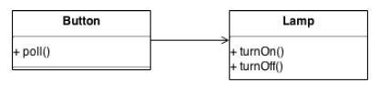
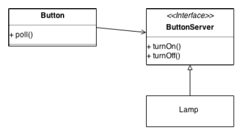
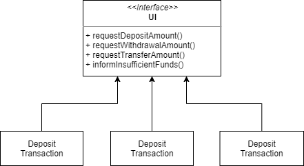
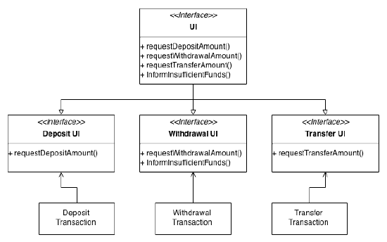

# Program Development Guidelines

> Quality comes not from inspection, but from improvement of the production process.

\- W. Edwards Deming


---

### Design

D1 - Write code that communicate its purpose and intent (readability)

D2 - Code Refactoring

D3 - Favor object composition over class inheritance

D4 - Programming to an interface, not an implementation (but DON't overdo it)

D5 - Be SOLID (**S**ingle responsibility, **O**pen-closed, **L**iskov substitution, **I**nterface segregation, and **D**ependency inversion)

D6 - Premature optimization is the root of all evil


## Coding

C1 - Use intention-revealing names

C2 - Use enum instead of constants to define a finite set of values

C3 - Use exceptions rather than return codes

C4 - Use unchecked exceptions

C5 - Dont' return `null`

C6 - Prefer (and keep) debugging log messages to user of debuggers

C7 - Crash early


## Testing

T1 - Test everything that could possibly break (but NOT trivial accessors)

T2 - Put the test class in the same package as the class under test, in a `test` folder

T3 - Name the test methods with `[methodName]_Should[_expected_behaviour]_When[_state_under_test]`

---


## D1 - Write code that communicate its purpose and intent (readability)

Bugs sneak in when code need to be changed without a complete and clear understanding, it happens
when features were added to a piece of software by maintenance programmers (or author programmers
in their “maintenance mode”) within a tight timeframe.

**Programs must be written for people to read**

To some people who understand the craft of programming so well, programming is a way to
communicate one’s thoughts through code:

> Computer language is not just a way of getting a computer to perform operations but rather that it is a **novel formal medium for expressing ideas about methodology**. Thus, **programs must be written for people to read**, and only incidentally for machines to execute.

From The Structure and Interpretation of Computer Programs, Preface to the First Edition [^AS96]

**Good programmers write code that humans can understand**

It is fast and easy to work with readable code, that’s why Martin Fowler use the ability to write readable
code to measure the competence of a programmer:

> Any fool can write code that a computer can understand, **good programmers write code that humans can understand**.

Source: [^FBBOR99] p.15.


## D2 - Code Refactoring

To quote the original sermon on structured programming by Edsger Dijkstra:

> The extent to which the program correctness can be established is not purely a function or the program's external specifications and behavior but depends critically on its internal structure.

Source [^Dij70] p.5

**Refactor the code to make program easier to read and therefore easier to maintain**

> Refactoring is the process of changing a software system in such a way that it does not alter the external behavior of the code yet **improves its internal structure**. It is a disciplined way to clean up code that **minimizes the chances of introducing bugs**. In essence when you refactor you are **improving the design of the code after it has been written**.

> "Improving the design after it has been written." That's an odd turn of phrase. In our **current understanding of software development we believe that we design and then we code**. A good design comes first, and the coding comes second. Over time the code will be modified, and the integrity of the system, its structure according to that design, gradually fades. The code **slowly sinks from engineering to hacking**.

> Refactoring is the opposite of this practice. With refactoring you can take a bad design, chaos even, and rework it into well-designed code. Each step is simple, even simplistic. You move a field from one class to another, pull some code out of a method to make into its own method, and push some code up or down a hierarchy. Yet the cumulative effect of these small changes can radically improve the design. It is the exact **reverse of the normal notion of software decay**.

> With refactoring you find the balance of work changes. You find that design, rather than occurring all up front, occurs continuously during development. You learn from building the system how to improve the design. The resulting interaction leads to a program with a design that stays good as development
> continues.

From the preface of *Refactoring: Improving the Design of Existing Code* [^FBORR99]

**Good designs are easy to test and difficult to mess up**

Tom DeMarco et al put their insight about software design improvement in *Adrenaline Junkies and*
*Template Zombies: Understanding Patterns of Project Behavior* [^DHLMRR08]:

> …be capable and willing to look in detail at your people’s designs, and be aware enough to see quality when it’s there. Doing this for even the shortest time will quickly convince you that the gold-plating argument is a red herring; no design is made better in any way by piling on added features or glitz. Rather, **what enhances a design’s aesthetic is what is taken away**. The best designs are typically
> spare and precisely functional, **easy to test and difficult to mess up when changes are required**. Moreover, they make you feel that there could be no better way to achieve the product’s assigned functionality.


## D3 - Favor object composition over class inheritance

This is an excerpt from Design Patterns: Elements of Reusable Object-Oriented Software, [^GHJV96] pp.19-20:

> **Inheritance breaks encapsulation**
>
> But class inheritance has some disadvantages too. First, you can't change the implementations inherited from parent classes at run-time, because inheritance is defined at compile-time. Second, and generally worse, parent classes often define at least part of their subclasses' physical representation. Because inheritance exposes a subclass to details of its parent's implementation, **it's often said that "inheritance breaks encapsulation". The implementation of a subclass becomes so bound up with the implementation of its parent class that any change in the parent's implementation will for the subclass to change**.
>
> Implementation dependencies can cause problems when you're trying to reuse a subclass. Should any aspect of the inherited implementation not be appropriate for the new problem domains, the parent class must be rewritten or replaced by something more appropriate. This dependency **limits flexibility and ultimately reusability**. One cure for this is to inherit only from abstract classes, since they usually provide little or no implementation.
>
> Object composition is defined dynamically at run-time through objects acquiring references to other
> objects. Composition requires objects to respect each other's interfaces, which in turn requires carefully designed interfaces that don't stop you from using one object with many others. But there is a payoff. Because objects are accessed solely through their interfaces, we don't break encapsulation. Any object can be replaced at run-time by another as long as it has the same type. Moreover, because an object's implementation will be written in terms of object interfaces, there are substantially fewer implementation dependencies.
>
> Object composition has another effect on system design. **Favoring object composition over class inheritance helps you keep each class encapsulated and focused on one task**. Your classes and **class hierarchies will remain small and will be less likely to grow into unmanageable monsters**. On the other hand, a design based on object composition will have more objects (if fewer classes), and the system's behavior will depend on their interrelationships instead of being defined in one class. 
>
> That leads us to our second principle of object-oriented design:
>
> **Favor object composition over class inheritance**
>
> Ideally you shouldn't have to create new components to achieve reuse. You should be able to get all the functionality you need by assembling existing components through object composition. But this is rarely the case, because the set of available components is never quite rich enough in practice. Reuse by inheritance makes it easier to make new components that can be composed with old ones. Inheritance and object composition thus work together.
>
> 
>
> **Beware of overusing inheritance**
>
> Nevertheless, our experience is that designers **overuse inheritance as a reuse technique** and designs
> are often made more reusable (and simpler) by depending more on object composition.


## D4 - Programming to an interface, not an implementation [^GHJV96] p.18

**Beware of overusing interface**

This is perhaps a more well received concept, for example, the Spring Framework encourage the use of this pattern, it is often to see `@Service` usage examples with `@Service` applied on an interface reference, and use Spring Dependency Injection (DI) to inject an implementation instance. It is flexible when you need another implementation for the interface, just change the declaration in xml file to ask Spring to inject another implementation instance without recompiling the source code, at the cost of an additional interface class.

However, you would not do it extensively for every class used in your modules, you would not create a `Date` interface, so that we can inject another `Date` implementation just in case. (Java SE 8 indeed provides another set of date and time classes implementation, JSR-310)

More likely is when your code need some bug fix or enhancement, often require adding methods or parameters so that it could not be done by just injecting another implementation. Ask yourself, how many interfaces at your code base having only one implementation? How often you need to fix the very one implementation and that change propagates back to its interface? Unstable interfaces are only burdens for maintenance.

**Modern mock framework don’t need interface to mock**

Another reason for having interfaces is for testability. Before the invention of modern mocking library, interfaces are required to implement mock objects, for example, [jMock](http://jmock.org/) can only mock interfaces. However, the invention of modern mocking library like Mockito make concrete class mocking possible, thus interfaces should be exist solely for testability.

For more about when not to apply this principle, see OCP in the section “D5 Be SOLID”.


## D5 - Be SOLID

SOLID is a mnemonic acronym introduced by Michael Feathers [^SOLID] for the “first five principles” named by Robert C. Martin. The principles are Single Responsibility Principle (SRP), Open-Closed Principle (OCP), Liskov Substitution Principle (LSP), Dependency-Inversion Principle (DIP), and Interface-Segregation Principle (ISP). Martin dedicates 5 chapters, one chapter for each principle in his Jolt Award-winning book *Agile Software Development: Principles, Patterns and Practices*. [^Mar03]


**Single Responsibility Principle (SRP)**

SRP requires that a class should have only one responsibility (reason to change). For example, if a class contains both business rules and persistence control, it has two responsibilities, hence violating the SRP.


**Open-Closed Principle (OCP)**

OCP requires that software entities (classes, modules, functions, etc.) should be open for extension, but closed for modification. In general it is an application of “programming to an interface, not an implementation”

However, as Martin pointed out in his book:

> ...**conforming to the OCP is expensive**. It takes development time and effort to create the appropriate abstractions. Those abstractions also increase the complexity of the software design. There is a limit to the amount of abstraction that that developers can afford. **Clearly, we want to limit the application of the OCP to changes that are likely**. How do we know which changes are likely? We do the **appropriate research**, we ask the **appropriate questions**, and we use our experience and common sense. And after all that, we **wait until the changes happen!**

Source [^Mar03] p.105

> …apply abstraction only to those parts of the program that exhibit frequent change. **Resisting premature abstraction is as important as abstraction itself**.

Source [^Mar03] pp.108-109


**Liskov Substitution Principle (LSP)**

LSP requires that subtypes must be substitutable for their base types.

> Violating the LSP often results in the use of Run-Time Type Information (RTTI) in a manner that grossly
> violates the OCP. Frequently, an explicit if statement of if/else chain is used to determine the type of an
> object so that the behavior appropriate to that type can be selected,

Source [^Mar03] p.112

The following listing shows how LSP is violated:

```java
void drawShape(Shape shape) {
  if (shape instanceof Square)
    ((Square) shape).draw();
  else if (shape instanceof Circle)
    ((Circle) shape).draw();
}
```

The `drawShape()` violates OCP because it must be changed whenever new derivatives of Shape are created.


**Dependency-Inversion Principle (DIP)**

DIP requires that

a. High-level modules should not depend on low-level modules. Both should depend on abstractions.

b. Abstractions should not depend on details. Details should depend on abstractions.


In short it is also an application of “programming to an interface, not an implementation”; consider the following solution that violates the DIP:



The following is a solution that conform to the DIP, a high-level module (Button) depends on an abstraction (ButtonServer), and detail (Lamp) depends on an abstraction:



Similarly to OCP, “resisting premature abstraction” heuristic applies.


**Interface-Segregation Principle (ISP)**

ISP deals with the **disadvantages of “fat” interfaces**, it requires that **clients should not be forced to depend on methods that they do not use**. In other words, the “fat” interfaces can be broken up into groups of methods, each group serves a different set of clients.

The following diagram shows a “fat” interface:



With ISP applied:



However, Martin also points out in his book:

> **As with all principles, care must be taken not to overdo it**. The spectre of a class with hundreds of different interfaces, some segregated by client and others segregated by version, would be frightening indeed.

Source [^Mar03] p.145

Martin was kind enough to put the articles (not exactly the same but very similar to those in his book) in the Object Mentor web site, check them out:

http://www.objectmentor.com/resources/articles/srp.pdf

http://www.objectmentor.com/resources/articles/ocp.pdf

http://www.objectmentor.com/resources/articles/lsp.pdf

http://www.objectmentor.com/resources/articles/isp.pdf

http://www.objectmentor.com/resources/articles/dip.pdf


## D6 - Premature optimization is the root of all evil

**Needless complexity reduce maintainability**

To quote from *Computer programming as an art* by Donald E. Knuth:

> Another important aspect of program quality is the efficiency with which the computer's resources are actually being used. I am sorry to say that many people nowadays are condemning program efficiency, telling us that it is in bad taste. The reason for this is that we are now experiencing a reaction from the time when efficiency was the only reputable criterion of goodness, and programmers in the past have tended to be so preoccupied with efficiency that they have produced **needlessly complicated code**; the result of this unnecessary complexity has been that **net efficiency has gone down, due to difficulties of debugging and maintenance**. The real problem is that programmers have spent far too much time worrying about efficiency in the wrong places and at the wrong times; **premature optimization is the root of all evil** (or at least most of it) in programming.

Source [^Knu74] p.671.


Dijkstra put it in this way:

> My refusal to **regard efficiency considerations as the programmer's prime concern** is not meant to imply that I disregard them. On the contrary, efficiency considerations are recognized as one of the main incentives to modifying a logically correct program. My point, however, is that **we can only afford to optimize** (whatever that may be) **provided that the program remains sufficiently manageable**.

Source [^Dij70] p.7.


**Not an excuse for making bad choices**

Don’t use it as an excuse to

> defend all sorts of choices, ranging from poor architectures, to gratuitous memory allocations, to inappropriate choices of data structures and algorithms, to complete disregard for variable latency in latency-sensitive situations.

Source [^Duf10]

However, think twice when you are going to spend a few hours or so to do an optimization.


## References:

[^AS96]: Structure and Interpretation of Computer Programs (Second Edition), Harold Abelson and Gerald Jay Sussman with Julie Sussman, The MIT Press, 1996. [link](http://mitpress.mit.edu/sicp/full-text/book/book-Z-H-7.html#%_chap_Temp_4)

[^DHLMRR08]: Robertson, Adrenaline Junkies and Template Zombies: Understanding Patterns of Project Behavior, Tom DeMarco, Peter Hruschka, Tim Lister, Steve McMenamin, James Robertson, Suzanne Dorset House, 2008.

[^Dij70]: Notes on Structured Programming (Second Edition), Edsger W. Dijkstra, 1972. [link](https://www.cs.utexas.edu/users/EWD/ewd02xx/EWD249.PDF)

[^Duf10]: The 'premature optimization is evil' myth, Joe Duffy, 2010. [link](http://joeduffyblog.com/2010/09/06/the-premature-optimization-is-evil-myth/)

[^FBBOR99]: Refactoring: Improving the Design of Existing Code, Martin Fowler et al., Addison-Wesley, 1999

[^GHJV96]: Design Patterns: Elements of Reusable Object-Oriented Software, Erich Gamma, Richard Helm, Ralph Johnson, John Vlissides, Addison-Wesley, 1996.

[^Knu74]: Donald E. Knuth, “Computer programming as an art”, ACM, 1974. [link](https://dl.acm.org/doi/10.1145/361604.361612)

[^Mar03]: Agile Software Development: Principles, Patterns and Practices, Robert C. Martin, Pearson Education, 2003.

[^SOLID]: Wikipedia, 2014-12-19. [link](http://en.wikipedia.org/wiki/SOLID_%28object-oriented_design%29)
